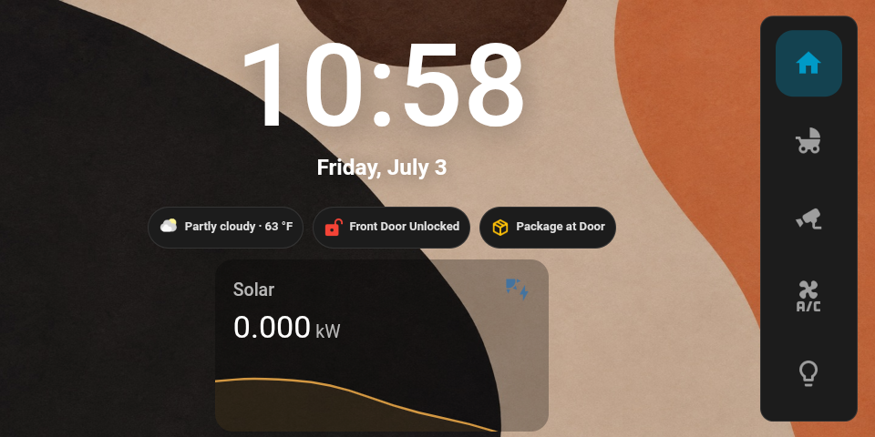
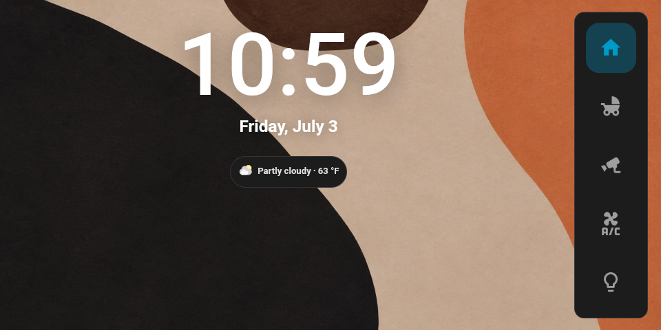

# Echo Show 5 Bedside Dashboard for Home Assistant

A minimalist bedside control panel running on a jailbroken **Amazon Echo Show 5 (2nd gen)** — giant clock, baby monitor, CCTV wall, and climate/lamp controls, all driven by Home Assistant and [View Assist](https://dinki.github.io/View-Assist/).

> **Inspired by [I built the perfect bedside clock for Home Assistant](https://www.youtube.com/watch?v=6p5wvVl957c&t=168s) by [The Stock Pot](https://www.youtube.com/@TheStockPot-AU).** The layout concept (floating clock over abstract art, right-side icon rail) and the wallpaper come from that video — go watch it.



*Alert chips (door unlocked / package detected) and the solar sparkline only appear when relevant. At night it idles clean:*



## Views

| View | What's on it |
|---|---|
| **Home** | Giant clock + date, weather chip (Mushroom), conditional alert chips (front door unlocked, package at the door), and a solar-production sparkline that only renders while the sun is up |
| **Baby** | Full-screen live nursery camera. When the camera's **baby-cry audio detection** fires, a flashing red banner appears over the view, a red badge lights the Baby tab from every view, and a "Baby Crying" chip shows on Home |
| **CCTV** | Full-width front-camera strip on top, doorbell + side camera below — all as ~10-second snapshot tiles (tap for live). The doorbell's package camera appears as a third tile **only while a package is detected** |
| **Controls** | Bedroom thermostat, a three-segment lamp switcher (left / right / both), and a volume-only media player row |

The right-side navbar is icon-only with two extras: a media player widget that appears only while something is playing on the display, and a lightbulb that directly toggles both bedside lamps (filled/outline reflects state).

## Hardware & prerequisites

- **Echo Show 5 (2nd gen)** jailbroken and running LineageOS (`cronos`). A used one costs almost nothing.
- **[View Assist Companion App (VACA)](https://github.com/msp1974/ViewAssist_Companion_App)** sideloaded on the device.
- **[View Assist](https://dinki.github.io/View-Assist/)** custom integration in Home Assistant.
- Cameras that expose entities in HA (mine are UniFi Protect + one ONVIF); a lock, a thermostat, lamps, a weather provider, and optionally a solar power sensor.

### HACS frontend dependencies

- [navbar-card](https://github.com/joseluis9595/lovelace-navbar-card)
- [card-mod](https://github.com/thomasloven/lovelace-card-mod)
- [Mushroom](https://github.com/piitaya/lovelace-mushroom) (chips)
- [stack-in-card](https://github.com/custom-cards/stack-in-card)
- [mini-media-player](https://github.com/kalkih/mini-media-player)
- [Advanced Camera Card](https://github.com/dermotduffy/advanced-camera-card)

Everything else is native HA cards on purpose — the Echo Show's SoC is weak, and this dashboard is deliberately light (snapshot tiles instead of streams on the CCTV grid, one live stream max at a time, no heavy animations).

## Install

1. **Wallpaper**: copy [`wallpaper/bedside-wallpaper.png`](wallpaper/bedside-wallpaper.png) to `/config/www/bedside/bg.jpg` (I resized to 1440px wide / JPEG ~85 to keep it light).
2. **Dashboard**: create a new dashboard with URL path `bedside-panel` (the path **must contain a hyphen**, and the navbar routes in the YAML point at `/bedside-panel/...`). Open the Raw Configuration Editor and paste [`dashboard.yaml`](dashboard.yaml).
3. **Entities**: replace the placeholders with yours:

   | Placeholder | Replace with |
   |---|---|
   | `camera.nursery_camera` | your baby cam (use a **720p/medium channel** — 1080p is wasted on a 960×480 screen) |
   | `binary_sensor.nursery_camera_baby_cry_detected` | your camera's cry-detection sensor (UniFi Protect: enable the entity *and* the detection toggle) |
   | `camera.front_camera` / `camera.side_camera` / `camera.doorbell_low_res` | your CCTV cameras |
   | `camera.doorbell_package_camera` + `binary_sensor.doorbell_package_detected` | doorbell package cam + detection |
   | `lock.front_door` | your door lock |
   | `light.bedside_lamp_left` / `light.bedside_lamp_right` | your lamps |
   | `climate.bedroom` | your thermostat |
   | `media_player.bedroom_speaker` | your bedroom speaker |
   | `media_player.vaca_media_player` | the VACA media player entity for your satellite |
   | `weather.home` / `sensor.solar_current_power_production` | weather + solar power sensors |

4. **View Assist**: in your satellite's options → *Dashboard options*, set **dashboard** to `/bedside-panel` and **home** to `/bedside-panel/home` so the display idles and reverts there.
5. **Autoboot**: make VACA the device launcher so a reboot lands straight on the dashboard:
   ```bash
   adb shell cmd package set-home-activity com.msp1974.vacompanion/.MainActivity
   ```
6. **Night-friendly brightness** (0–255; adaptive off):
   ```bash
   adb shell settings put system screen_brightness_mode 0
   adb shell settings put system screen_brightness 3
   ```
7. **card-mod load order** (important): add this to `configuration.yaml`, or styling silently fails on cold boots of the device's WebView:
   ```yaml
   frontend:
     themes: !include_dir_merge_named themes
     extra_module_url:
       - /hacsfiles/lovelace-card-mod/card-mod.js
   ```

## Hard-won gotchas

Things that cost me real time on this device, so you don't have to:

- **card-mod cannot style Advanced Camera Card** here — `ha-card`, `:host`, and a `mod-card` wrapper all fail silently. Want an alert on the camera view? Put a conditional banner card *above* the camera (that's what the flashing cry banner is).
- **Size snapshot tiles with `aspect_ratio`, not card-mod heights.** card-mod height caps don't apply to `picture-entity` in this WebView; the native `aspect_ratio` option does a proper cover-crop, and `object-position` via card-mod still works for framing.
- **Don't put margins on cards inside `horizontal-stack`** — it breaks the equal-width flex math on this WebView and tiles shrink or misrender.
- **CSS animations lose to `!important`.** The flashing banner's background comes *only* from the `@keyframes` — a static `background: … !important` would freeze it.
- **Snapshot resolution ≠ channel resolution** (UniFi Protect): `camera_proxy` snapshots are full-res regardless of which channel entity you use. Channel choice only matters for live streams — so point tiles at low-res channels to make *tap-to-live* cheap.
- **Dashboard URL paths must contain a hyphen.** HA rejects `bedside`; `bedside-panel` works.

## Credits

- Design & wallpaper: [The Stock Pot — I built the perfect bedside clock for Home Assistant](https://www.youtube.com/watch?v=6p5wvVl957c&t=168s). The wallpaper image is included for convenience and isn't mine — if you're the rights holder and want it removed, open an issue.
- [View Assist](https://dinki.github.io/View-Assist/) by dinki and the [Companion App](https://github.com/msp1974/ViewAssist_Companion_App) by msp1974, which make the Echo Show usable at all.

## License

Dashboard configuration and docs: [MIT](LICENSE). Wallpaper excluded (see credits).
